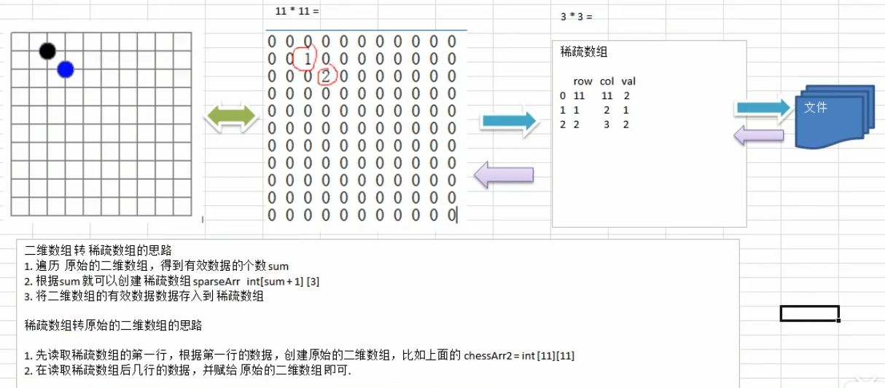

# 数据结构和算法

## 数据结构和算法的重要性

1. 算法是程序的灵魂，优秀的程序可以在海量数据计算时，依然保持高速算法
2. 一般来讲，程序会使用了内存计算框架（比如 Spark）和缓存技术（比如 Redis）等来优化程序，再深入的思考一下，这些计算框架和缓存技术，他的核心功能是哪个部分。

## 数据结构和算法的概述

## 1. 线性结构和非线性结构

数据结构包括：线性结构和非线性结构

### 1.1 线性结构

1. 线性结构作为最常用的数据结构，器她点就是数据元素之间存在一对一的线性关系
2. 线性结构有两种不同的存储结构，即顺序存储和链式存储结构。顺序存储的线性表称为顺序表，顺序表中的存储元素是连续的
3. 链式存储的线性表称为链表，聊表中的存储元素不一定是连续的，元素节点中存放数据元素以及相邻元素的地址信息
4. 线性结构常见的有：数组、队列、链表和栈

### 1.2 非线性结构

非线性结构包括：二位数组，多维数组，广义表，树结构，图结构

## 2. 稀疏数组和队列

### 2.1 稀疏数组 （sparsearray）


#### 2.1.1 基本介绍

当一个数组中大部分元素为 0，或者为同一个值的数组时，可以使用稀疏数组来保存该数组。

细数数组的处理方法是：

1. 记录数组一共有几行几列，有多少个不同的值
2. 把具有不同值的元素的行列及值记录在一个小规模的数组中，从而缩小程序的规模



#### 2.1.2 应用实例

1. 使用稀疏数组，来保留类似前面的二维数组（棋盘，地图等等）
2. 把稀疏数组存盘，并且可以从新恢复原来的二维数组
3. 整理思路


4. 代码实现

```java
package com.atguigu.sparsearray;

public class SparseArray {

	public static void main(String[] args) {
		// 创建一个原始的二维数组 11 * 11
		// 0: 表示没有棋子， 1 表示 黑子 2 表蓝子
		int chessArr1[][] = new int[11][11];
		chessArr1[1][2] = 1;
		chessArr1[2][3] = 2;
		chessArr1[4][5] = 2;
		// 输出原始的二维数组
		System.out.println("原始的二维数组~~");
		for (int[] row : chessArr1) {
			for (int data : row) {
				System.out.printf("%d\t", data);
			}
			System.out.println();
		}

		// 将二维数组 转 稀疏数组的思
		// 1. 先遍历二维数组 得到非0数据的个数
		int sum = 0;
		for (int i = 0; i < 11; i++) {
			for (int j = 0; j < 11; j++) {
				if (chessArr1[i][j] != 0) {
					sum++;
				}
			}
		}

		// 2. 创建对应的稀疏数组
		int sparseArr[][] = new int[sum + 1][3];
		// 给稀疏数组赋值
		sparseArr[0][0] = 11;
		sparseArr[0][1] = 11;
		sparseArr[0][2] = sum;
		
		// 遍历二维数组，将非0的值存放到 sparseArr中
		int count = 0; //count 用于记录是第几个非0数据
		for (int i = 0; i < 11; i++) {
			for (int j = 0; j < 11; j++) {
				if (chessArr1[i][j] != 0) {
					count++;
					sparseArr[count][0] = i;
					sparseArr[count][1] = j;
					sparseArr[count][2] = chessArr1[i][j];
				}
			}
		}
		
		// 输出稀疏数组的形式
		System.out.println();
		System.out.println("得到稀疏数组为~~~~");
		for (int i = 0; i < sparseArr.length; i++) {
			System.out.printf("%d\t%d\t%d\t\n", sparseArr[i][0], sparseArr[i][1], sparseArr[i][2]);
		}
		System.out.println();
		
		//将稀疏数组 --》 恢复成 原始的二维数组
		/*
		 *  1. 先读取稀疏数组的第一行，根据第一行的数据，创建原始的二维数组，比如上面的  chessArr2 = int [11][11]
			2. 在读取稀疏数组后几行的数据，并赋给 原始的二维数组 即可.
		 */
		
		//1. 先读取稀疏数组的第一行，根据第一行的数据，创建原始的二维数组
		
		int chessArr2[][] = new int[sparseArr[0][0]][sparseArr[0][1]];
		
		//2. 在读取稀疏数组后几行的数据(从第二行开始)，并赋给 原始的二维数组 即可
		
		for(int i = 1; i < sparseArr.length; i++) {
			chessArr2[sparseArr[i][0]][sparseArr[i][1]] = sparseArr[i][2];
		}
		
		// 输出恢复后的二维数组
		System.out.println();
		System.out.println("恢复后的二维数组");
		
		for (int[] row : chessArr2) {
			for (int data : row) {
				System.out.printf("%d\t", data);
			}
			System.out.println();
		}
	}

}
```

### 2.2 队列

#### 2.2.1 基本介绍

1. 队列是一个有序列表，可以用数组或是链表来实现
2. 遵循先入先出的原则。
3. 示意图：


