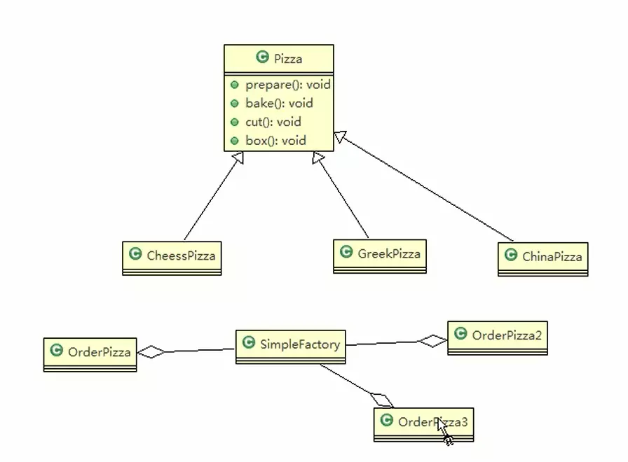
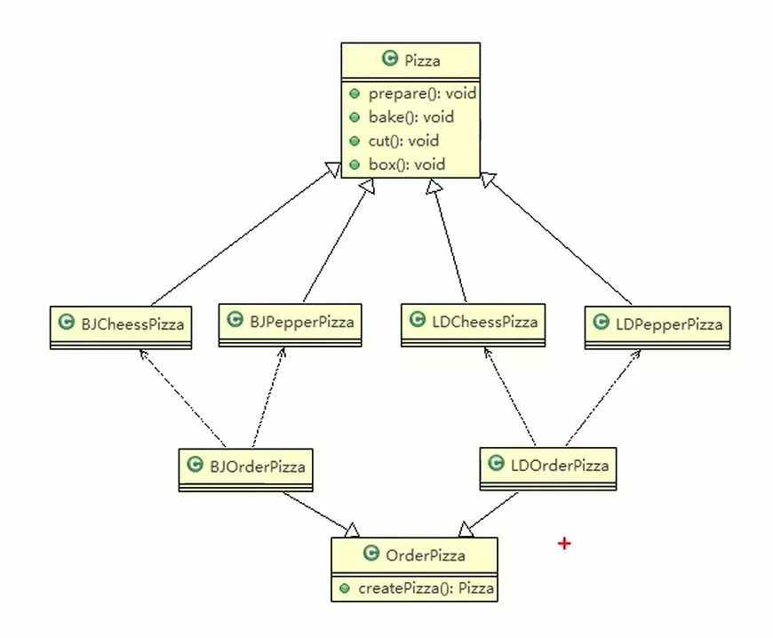
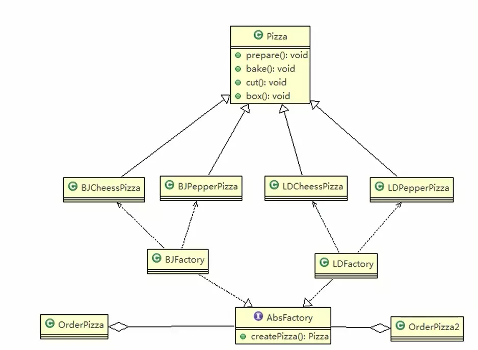

# 工厂模式

## 1. 简单工厂（静态工厂）

1. 简单工厂模式是属于创建型模式，是工厂模式中的一种，简单工厂模式决定创建出哪一种产品的实例，简单工厂模式是工厂模式中最简单实用的模式。
2. 简单工厂模式：定义一个创建对象的类，由这个类来封装实例化对象的行为
3. 在软件开发中， 当我们会用到大量的创建某种、某类或者某批对象时，就会使用到工厂模式

### 1）例子

看一个披萨项目，要求便于披萨种类的扩展和维护

1. 披萨种类多 (GreekPizz、CheesePizz )
2. 披萨的制作有 prepare、bake、cut、box
3. 完成披萨店订购功能

静态工厂，其实就是简单工厂，将创建实例对象的方法添加 static 关键字

在SinmpleFactory 中，就有一个获取对应披萨实例的方法，只需要你传入对应的类型，就可以获取得到对应实例。而 OrderPizza 就有创建披萨，只需要调用SinmpleFactory  中的方法即可实现。以后扩展类别，只需要向 SinmpleFactory  中添加新对象即可。无需改动 OrderPizza.

## 2. 工厂方法模式

1. 工厂方法模式：定义一个创建对象的抽象方法，由子类决定实例化的类，工厂方法模式将对象的实例化推迟到子类。

### 1. 例子

披萨项目新的需求：客户在点披萨时，可以点不同口味的披萨，比如北京的奶酪披萨，伦敦的披萨等等，加入不同区域的披萨

如果按简单工厂看，就是 BJOrderPizza 会用一个工厂类来获取BJ的披萨（这个BJOrderPizza 会用到一个 Factory 类 Factory 来存着披萨类别，扩展的披萨类别都添加在这个Factory中，这里就用 bjFatory 实例表示）， LDOrderPizza 也是如此（ldFacroty），现在条件添加，需要多考虑，由于创建披萨对象的方法都放在各自的订购中调用不同的 Factory（bjFatory ，ldFacroty） 来创建实例，现在将相同的部分抽离到抽象类，由抽象类创建一个抽象方法，给实例实现调用各自的Factory（bjFatory ，ldFacroty）中创建 披萨的方法 。**更简单的方法不要简单工厂类，将各自简单工厂创建对象的方法实现到抽象方法中,上面图就是这样的意思。**

图分析： OrderPizza 是工厂，BJOrderPizza 和 LDOrderPizza 是工厂子类的具体实现

## 3.抽象工厂模式

1. 抽象工厂模式：定义一个 interface 用于创建相关或有依赖关系的对象族，而无需指明具体的类。
2. 抽象工厂模式，可以将简单工厂模式和工厂方法模式进行整合。
3. 从色剂层面看，抽象工厂模式就是对简单工厂模式的改进（或者称为进一步抽象）。
4. 将工厂抽象成两层，AbsFactory（抽象工厂）和具体的工厂子类。程序员可以根据对象类型使用对应的工厂子类。这样将单个的简单工厂类变成了工厂族，更利于代码的维护和扩展

就是将工厂方法的例子改造成抽象工厂的。工厂方法是将实现交给子类，而抽象工厂是将多个简单工厂抽离出来。

## 4 JDK 例子

JDK Calendar 日期类，用简单工厂模式

